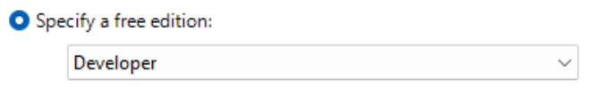
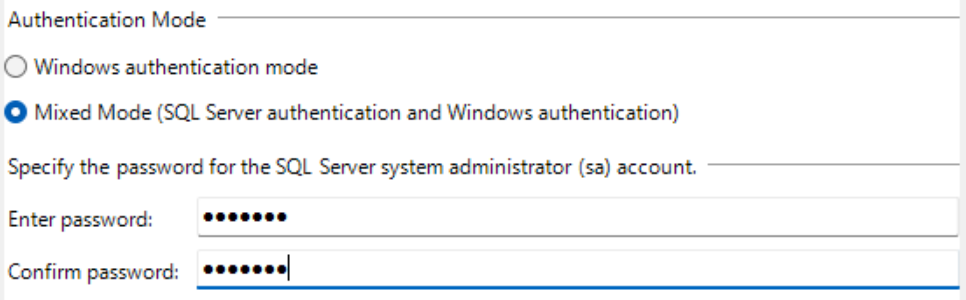
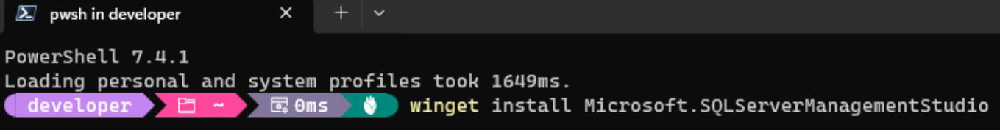
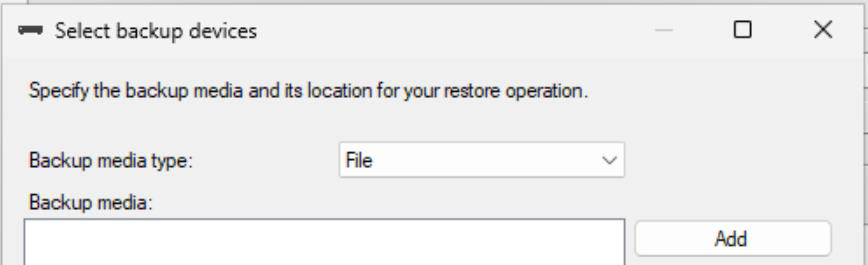

---

<div style="text-align:center;padding-top:100px;">
<a href="https://github.com/ZeroKlu">

</a>
</div>

<div style="text-align:center;font-size:16pt;padding-bottom:100px;">
C# and .NET Training - Workstation Setup Guide
</div>

---

<div style="page-break-after: always;"></div>

### Purpose:

Performing development requires a few components to be installed on 
your workstation. For .NET (C#) development, you will need to have 
Visual Studio installed.

For those who have Visual Studio Code installed, we will also review 
setting up that environment for .NET development.

If you want to set up your development environment similar to mine, the 
instructions below will walk you through the setup process. If you’re 
following these steps, it is best to do them in the order presented.

<div style="page-break-after: always;"></div>

### Table of Contents:

- [Prerequisites](#prerequisites)
- [Install Visual Studio](#install-visual-studio)
- [Prep Your File System](#prep-your-file-system)
- [Set Up Visual Studio](#set-up-visual-studio)
- [Customize Visual Studio Code](#customize-vs-code)
- [Create a Sample Application](#create-a-sample-application)
- [Customize Visual Studio](#customize-visual-studio)
- [Clone the .NET Training Repository](#clone-repo)
- [Install SQL Server](#install-sql)
- [Install SQL Server Management Studio](#install-ssms)
- [Restore the Sample Database](#restore-db)
- [(optional) Install Codeium](#install-codeium)

### <a id="prereq"></a>Prerequisites

Prior to any of the steps listed below, please complete all tasks in the guide 
titled:

[01 Setting Up Your Workstation for Development Training.pdf](./01%20Setting%20Up%20Your%20Workstation%20for%20Development%20Training.pdf)

<div style="page-break-after: always;"></div>

### <a id="vs-install"></a>Install Visual Studio

Microsoft Visual Studio is the industry standard IDE for .NET 
development. While there are alternative platforms, we will be using 
Visual studio throughout the training for both C# and later the Unity 
API.

One very important note: If you are using the Community Edition of 
Visual Studio, you cannot develop, build, or deliver software to 
clients. Commercial use requires a licensed edition. If you believe you 
require a license for visual studio, discuss acquiring one with your 
leadership.

1. In your terminal, run one of the following commands (based on the
    edition you are using):  
    
    * Community Edition:  
      `winget install Microsoft.VisualStudio.2022.Community`
    * Professional Edition:  
      `winget install Microsoft.VisualStudio.2022.Professional`
    * Enterprise Edition:  
      `winget install Microsoft.VisualStudio.2022.Enterprise`

2. Click "Yes" on the UAC prompt.  
   

3. First, the Visual Studio Installer will be installed. This component 
   can be used later to modify or update your installation.  
   

4. This installer will then install Visual Studio 2022.  
   

5. After completion, you will see a “successfully installed” message in 
   the terminal.  
   

> We now need to add some development components to the installation.

6. Click on the start button. Then search for and run the “Visual 
   Studio Installer”  
   

7. You may see an alert like the one below, indicating that an updated 
   version is available. If you do, we’ll update the installation 
   first. If not, you can skip to [step 10](#vs-step-10).  
   

8. Click the [Update] button and respond “Yes” to the UAC alert  
   

9. The update will run automatically  
   

10. <a href="#vs-step-10"></a>After the update (or immediately, if no 
    update was available), you will see the below options. Click on 
    [Modify] to proceed.  
    

11. In the left-hand pane, check the box on the “ASP.NET and web
    development” function group.  
    

12. In the right-hand pane (Installation Details), make sure all of the 
    below options are checked:  
    

13. Back in the left-hand pane, check the box for “.NET desktop 
    development”  
    

14. In the right-hand pane (Installation Details), make sure all of the 
    below options are checked:  
    
    

15. Click on “Modify”  
    

16. As usual, respond “Yes” to the UAC warning:  
    

> Note: You can install any additional components you want, but the 
> items listed above are sufficient for everything covered in the 
> training course.

17. The Visual Studio components will now install.  
    

18. After completion, close out of the Visual Studio installer and 
    proceed to the next section.

<div style="page-break-after: always;"></div>

### <a id="fs-prep"></a>Prep Your File System

As part of the next section, we will be creating a sample project. 
We’ll need somewhere to place it.

1. On your PC, create a folder called “Visual Studio Projects” (I 
   created mine on the C: root)  
   

<div style="page-break-after: always;"></div>

### <a id="vs-setup"></a>Set Up Visual Studio

Visual Studio is highly configurable, and we will not be addressing the 
majority of the options here. However, there are several that will make 
the experience easier in training, so we will handle them now.

1. Launch Visual Studio  
   

2. You will be prompted to log in with your Microsoft account. Click on 
   “Sign In”
   > Note: Do not skip this step, as we need to set up with a Microsoft 
   > account for a later step  

   

3. On the “Sign in” dialogs, enter the email and password for your 
   Microsoft Account You should already have an MS account associated 
   with the email address you used to obtain your Visual Studio 
   license.  
   

4. Once you have successfully logged in, you will be prompted to select 
   a color theme. I use the default “Dark” theme, but you can configure 
   yours however you like.  
     
   Once you select your theme, click on [Start Visual Studio] and 
   continue to the next section

<div style="page-break-after: always;"></div>

### <a id="app-create"></a>Create a Sample Application

Now we need to make sure everything installed properly by creating a 
sample application in Visual Studio.

1. If it’s not already running, launch Visual Studio  
   

2. On the startup dialog, select the option to “Create a new project”  
   

3. Search for “console” and select the option for “Console App” Then 
   click “Next”  
   
   

4. Name the project “HelloWorld”  
   

5. Modify the location to point to the “Visual Studio Projects” folder 
   you created previously, then click [Create]  
   
   

6. Select ".NET 8.0" for the target framework, then click [Create]
   
   

7. Add the following code in the Program.cs file that gets created for 
    you (don’t worry about understanding it for now):

    ```csharp
    using System;

    namespace HelloWorld
    {
        internal class Program
        {
            static void Main(string[] args)
            {
                Console.WriteLine("Hello World!");
                _ = Console.ReadLine();
            }
        }
    }
    ```

    

8. At the top of the screen, click the “Start” button to run the 
   program.  
   

9. You should see the following in a new terminal window:  
   

<div style="page-break-after: always;"></div>

### <a id="customize-visual-studio"></a>Customize Visual Studio

There are a few optional convenience settings I recommend in Visual 
Studio.

1. In Visual Studio, click on TOOLS > OPTIONS  
   
   

2. Under “Projects and Solutions,” select “Locations”  
   

3. Update the paths to use the “Visual Studio Projects” folder you 
   created earlier in the process.  
   

4. Under “Source Control,” select “Git Global Settings”  
   

5. Enter the username and email address you use for Git (these may 
   already be filled in), and change the default location to your 
   “Visual Studio Projects” folder, then click [OK].  
   
   

<div style="page-break-after: always;"></div>

### <a id="customize-vs-code"></a>Customize Visual Studio Code

# TODO

<div style="page-break-after: always;"></div>

### <a id="clone-repo"></a>Clone the .NET Training Repository

You’ll need to clone a copy of the training repository to work with.

The repository is located here:

* GitHub: https://github.com/ZeroKlu/csharp-training-gh

1. In a browser, navigate to the GitHub repository and make sure
   you're able to access it.
   * If you cannot, request access from
     [zeroklu@protonmail.com](mailto:zeroklu@protonmail.com?subject=C#%20Training%20Repository%20Access%20Request).

2. If you will be using Visual Studio, continue to
   [step 3](#clone-step-3).  
   If you will be using Visual Studio Code, skip to
   [step 7](#clone-step-7).

3. <a id="clone-step-3"></a>Launch Visual Studio  
   

4. On the startup dialog, select the option to “Clone a repository”.  
   

5. in the URL to the repository you want to clone, verify that the 
   “Path” target is your Visual Studio Projects folder, and click 
   “Clone.”  
   
   

6. The repository will be copied to your local machine.  
   

If you will be using Visual Studio, skip to
[Install SQL Server](#install-sql).

7. <a id="clone-step-7"></a>Launch Visual Studio Code  
   

8. Click on the Source Control icon  
   

9. Click on the button to “Clone Repository”  
   

10. Enter the URL to the repository you want to clone, then click 
    "Clone from URL"  
   

<div style="page-break-after: always;"></div>

### <a id="install-sql"></a>Install SQL Server

1. Download the installation you prefer:  
   [SQL Server Developer Edition](https://go.microsoft.com/fwlink/p/?linkid=2215158&clcid=0x409&culture=en-us&country=us)
   or
   [SQL Server Express Edition](https://go.microsoft.com/fwlink/p/?linkid=2216019&clcid=0x409&culture=en-us&country=us)  
   \* I recommend SQL Server Developer Edition

2. Right-click the downloaded ISO file and choose “Mount”  
   

3. From the mounted drive, run setup.exe  
   

4. Wait for the initial load to complete.  
   

5. When the installer dialog loads, select “Installation.”  
   

6. Select the option to create a “New SQL Server standalone 
   installation…”  
   

7. Select your free edition and click [Next]  
   

8. Accept the license terms, then click [Next]  
   

9. Your system will be scanned for compatibility with the install.  
   

10. You may receive a warning about the Windows Firewall. This is not a 
    problem for our purposes  
    

11. Uncheck the option for the Azure extension and click [Next]. We 
    won’t be working in Azure.  
    

12. Under “Instance Features,” we only need “Database Engine Services.” 
    Click [Next]  
    

13. Leave the default selection of “Default instance” and click [Next]  
    

14. Leave the default service settings and click [Next]  
    

15. Change the “Authentication Mode” to “Mixed Mode…” and enter a 
    password for the SA user.  
    

16. Click the button labeled “Add Current User”  
    

17. After your Windows user appears in the list, click [Next]  
    

18. Review the installation summary, and click “Install”  
    

19. SQL Server will install. This may take several minutes, so be 
    patient.  
    

20. When the install completes, you should see the following:  
    

<div style="page-break-after: always;"></div>

### <a id="install-ssms"></a>Install SQL Server Management Studio (SSMS)

SQL Server Management Studio no longer installs along with the database engine. It is a separate, version-independent component. So, we’ll need to install it now.

1. In your terminal, run the following command:  
   `winget install Microsoft.SQLServerManagementStudio`  
   

2. Respond “Yes” to the UAC prompt  
   

3. The installer will run  
   

<div style="page-break-after: always;"></div>

### <a id="restore-db"></a>[Restore the Sample Database]

I have provided an example database that includes the data we will use 
in training. We need to make the database available in the SQL Server 
instance we just set up.

1. Launch SQL Server Management Studio  
   

2. Log in either using Windows authentication as the user you added 
   during the installation or SQL Server authentication with the SA 
   user password you set up during installation.  
   

3. Right-click on the “Databases” node and select “Restore Database”  
   

4. Select “Device” and click the browse […] button  
   

5. In the dialog that comes up, click the “Add” button  
   

6. Navigate into the repository you cloned earlier and into
   [00 - Resources/Setup Documents/database](./database/) folder, and 
   select the file called “ExternalData.bak” then click [OK] and [OK] 
   again.  
   

7. Leave the default settings and click [OK]  
   

8. After the restore completes, you should see the following message:  
   

9. The database will now appear under the “Databases” node. Select it.  
   

10. Expand the “Tables” node. There should be four tables:  
   

11. Click the “New Query” button at the top of the UI  
   

12. Enter the following SQL Query and click the “Execute” button or 
    press [F5]  
    ```sql
    SELECT TOP 10 * FROM dbo.ZipCodes
    ```  
    

13. You should see the following results of the query:  
    

<div style="page-break-after: always;"></div>

### <a id="install-codeium"></a>(optional) Install Codeium

# TODO

<div style="page-break-after: always;"></div>

---

<div style="text-align:center;font-size:16pt;padding-top:100px;padding-bottom:100px;">
    <p>Congratulations! Your system is set up for C# training.</p>
    <p>Happy Coding!</p>
</div>

---
