## Creating a Sample Project

Let's explore the process of creating a sample project.

---

### Creating a New Project in Visual Studio

Let's create a sample project in Visual Studio.

1. Launch Visual Studio.  
    

2. Click on the "Create a new project" button.  
    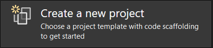

3. In the "Create a new project" dialog, select "Console App" and click 
   "Next".  
    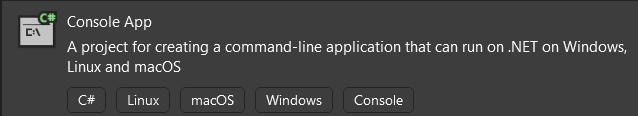

4. Make the project name "SimpleCSharpConsoleApp," point it to the 
   "Visual Studio Projects" folder you created earlier, and click "Next".  
    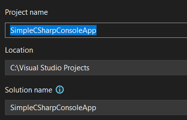

5. For the framework, select ".NET 8.0" and click "Create".  
    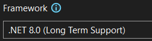

6. In the file that opens (program.cs), replace the template code with 
   the following:  
   ```csharp
   // Set up Console UI (CUI)
   Console.Title = "My Rocking App";
   Console.ForegroundColor = ConsoleColor.Yellow;
   Console.BackgroundColor = ConsoleColor.Blue;
   Console.WriteLine("*************************************");
   Console.WriteLine("***** Welcome to My Rocking App *****");
   Console.WriteLine("*************************************");
   Console.BackgroundColor = ConsoleColor.Black;

   // Wait for Enter key to be pressed
   Console.ReadLine();
   ```

7. Click on the "run" button to compile and run the program.  
      
    > Note: You can also navigate to the project folder in a terminal
    > and run the `dotnet run` command.

8. You should see the following output:  
    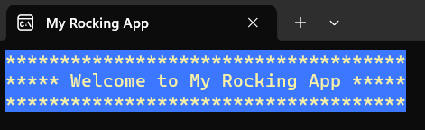

---

### Creating a New Project in Visual Studio Code

Let's create a sample project in Visual Studio Code.

1. Launch Visual Studio Code.  
    

2. Press `[CTRL]+[SHIFT]+[P]` to bring up the menu. Search for "new 
   project" and select ".NET: New Project"  
   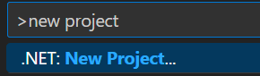

3. From the list of project templates, select "Console App"  
    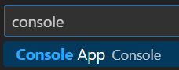

4. Name the project "SimpleCSharpConsoleApp" and press "Enter"  
    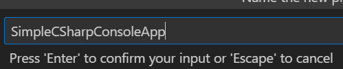

5. Select the option to "Choose another directory"    
    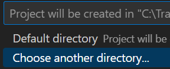

6. Navigate to the location where you want to create the project (
   your "VS Code Projects" folder, e.g.) and click on the "Select Folder"
   button.  
   

7. Click on "Create project ..."  
    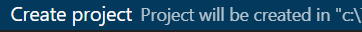

8. Locate the project folder, open the "program.cs" file, and replace 
   the template code with the following:  
   ```csharp
   // Set up Console UI (CUI)
   Console.Title = "My Rocking App";
   Console.ForegroundColor = ConsoleColor.Yellow;
   Console.BackgroundColor = ConsoleColor.Blue;
   Console.WriteLine("*************************************");
   Console.WriteLine("***** Welcome to My Rocking App *****");
   Console.WriteLine("*************************************");
   Console.BackgroundColor = ConsoleColor.Black;

   // Wait for Enter key to be pressed
   Console.ReadLine();
   ```

9. Click the drop-down arrow next to the "run" button and select the "Run
   project associated with this file" option.  
    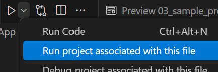  
    > Note: You can also navigate to the project folder in a terminal
    > and run the `dotnet run` command.

10. Once the project compiles and runs, you should see the following in the
    VS Code terminal:  
    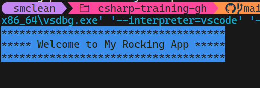  
    Note: Powershell 7 does not always respect the setting for 
    `Console.ForegroundColor`, but if you run your compiled executable in
    the standard command prompt, you should see the yellow text.  
    

---

### Changing the Target .NET Version

Sometimes it may be necessary to change the .NET version for a project. An
example of this is if you want to use .NET 8.0 in a project created in
Visual Studio Code after the release of .NET 9.

To change the .net version, you'll need to edit the project file
(`<project_name>.csproj`).

#### In Visual Studio Code

Find and open the file named `<project_name>.csproj` in the project folder.

#### In Visual Studio

Right-click on your project and select "Edit Project File"  
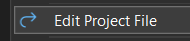

In the project file XML, you can specify any installed .NET version by
modifying the `TargetFramework` property.

```xml
<Project Sdk="Microsoft.NET.Sdk">

    <PropertyGroup>
        <OutputType>Exe</OutputType>
        <TargetFramework>net8.0</TargetFramework>
        <ImplicitUsings>enable</ImplicitUsings>
        <Nullable>enable</Nullable>
    </PropertyGroup>

</Project>
```

Note: In Visual Studio, you can also modify this from the project's
"Properties" tab.  
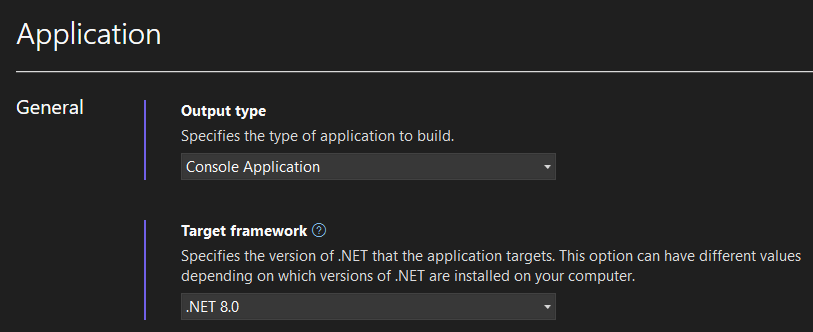

---

### C# 10 Availability

Since the book uses C# 10, it is important to ensure that we are using
a version of .NET that supports C# 10. For our purposes, that means .NET
6 or later, and specifically .NET 8 or later in order to be on a
currently supported version.

THis table shows the relationship between C# version and .NET version as
of the time of writing:

|Target Framework|Version|C# Language Version|
|-|-|-|
|.NET|9.x|C# 13|
|.NET|8.x|C# 12|
|.NET|7.x|C# 11|
|.NET|6.x|C# 10|
|.NET Core|5.x|C# 9|
|.NET Core|3.x|C# 8|
|.NET Core|2.x|C# 7.3|
|.NET Standard|2.1|C# 8|
|.NET Standard|2.0|C# 7.3|
|.NET Standard|1.x|C# 7.3|
|.NET Framework|all|C# 7.3|
|||

> Note: Although .NET 8 targets C# 12 instead of C# 10, all lessons in the
> book are supported.

---
