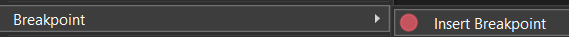

## Running and Debugging Your Code

In our previous lesson we chose to run our code without debugging. It is
important to develop your skills as a debugger as well as a coder. With
that in mind, let's look at how to debug our code.

---

### Adding Breakpoints

As a starting point, before debugging, it is useful to set breakpoints at
the locations in the code where you want to pause the execution of the
program and investigate the state of the application.

#### In Visual Studio

In Visual Studio, you can set breakpoints by right-clicking on the line of 
code and selecting "Insert Breakpoint".  

Adding a breakpoint to the first line of code looks like this:  

#### In Visual Studio Code

In Visual Studio Code, you can set breakpoints by clicking in the area to
the left of the line number.  

Adding a breakpoint to the first line of code looks like this:  

---

### Running and Debugging Your Code

Now, when we debug our code, the IDE will halt processing and allow us to
example the program's state (values of variables, etc.) at the location of
the breakpoint(s).

#### In Visual Studio

To run and debug, you can press [F5] or click the run button.  
  

#### In Visual Studio Code

To run and debug, click the drop-down arrow next to the "run" button and
select the "Debug project associated with this file" option.  
  

In our simple example, there is not much to examine, but we can see that
execution halts at the breakpoint.

---

### Continuing Execution

The debugger processes in both Visual Studio and Visual Studio Code
allow you to perform granular debugging by choosing to step through
each line of code, step over the current code block, etc.

We'll look at this in more depth as we get to more complicated 
examples. For now, let's look at how to let the code continue running
until it is complete (or until it reaches the next breakpoint).

#### In Visual Studio

To continue running, you can press [F5] or click the continue button.  

#### In Visual Studio Code

To continue running, you can press [F5] or click the continue button.  

---

### Picking an IDE

Moving forward, we will be using more of the advanced tools included with
Visual Studio, so I will no longer be presenting examples related to Visual
Studio Code.

This repository, for example, uses Visual Studio solution folders rather
than an actual folder tree for file organization and is poorly suited to
use in VS Code.

---
