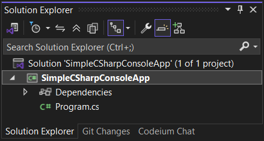
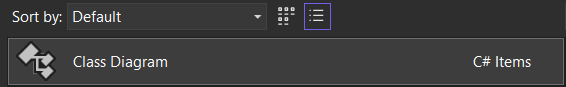
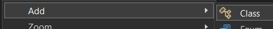
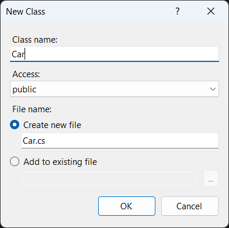
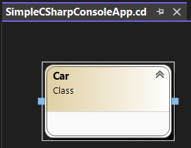
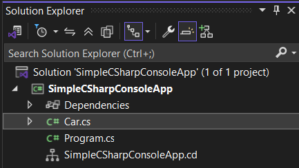
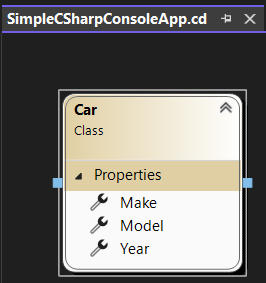

## Navigating Visual Studio

A key characteristic of good developers is an efficient workflow. That is,
delivering code both quickly and correctly (working, efficient, and up to
standards of best practices).

Creating a good workflow for yourself requires familiarity not only with
the programming language but with the IDE itself.

With that in mind, let's look at some of the important views in Visual 
Studio.

---

### Solution Explorer



The Solution Explorer is the main navigation view in Visual Studio. It is 
a tree view that shows all of the projects in the solution.

> Note: The Solution Explorer is not a representation of the file system.
> Folders, for example, may be created in a Visual Studio solution that do
> not exist in the file system.

The Solution Explorer is the default view shown to the right of the editor.

> Note: Selecting different nodes (the project versus the solution, e.g.)
> in the Solution Explorer will change the change the available options.

---

### Visual Class Diagram Tool

Visual Studio provides the Visual Class Diagram Tool to allow you to
visually design the classes in your project.

To add a class diagram to a project, right-click on the project in the
Solution Explorer and select "Add" > "New Item" and then choose the "Class
Diagram" option. 


After creating the class diagram, you can add a new class to it by either:

* Right-clicking on the diagram in the Solution Explorer and selecting 
  "Add" > "Class"  
    
  or
* Dragging the Class icon from the toolbox into the diagram.  
  

You will be presented with a dialog in which you can provide a name
(and a filename if you want it to be different) for your new class.



After naming the class and clicking "OK," the class will be added to the
diagram and to the project in the Solution Explorer.

  



If we look at the code file that was generated, it includes the shell of
a class. We can update it by adding a few properties like so:

```csharp
namespace SimpleCSharpConsoleApp
{
    public class Car
    {
        public string Class { get; set; }
        public string Make { get; set; }
        public string Model { get; set; }
        public int Year { get; set; }
    }
}
```

Don't worry too much about the code for now. We'll discuss these concepts
in a later lesson. But lif we save the changes and look back at the class
diagram, we can see that the class now has three properties.



---
